<!-- Synced from `/Users/hu_zhehao/Desktop/zzzhehao/manual/phylogeny/seq_prep.md` -->

# Sanger Sequence Assembly

The analysis of the generated sequences require some basic knowledge on [genetics, and phylogeny](https://zzzhehao.github.io/notebook/). 

---

Macrogen EZSeq and Eurofins Lightrun both return sequences in `ab1`, `phy`, and `txt` file. `txt` file is the facility-exported sequence but considering how shitty the sequences sometimes can be, I never look at them because I need to manually check and clean them anyway. `phy` file is to me some ancient file type that none of my workflows use. Macrogen also returns `pdf` files with chromatograms, it's wonderful to screen through to have a quick idea of whether the sequencing reaction went well or not. But the only file type that I am really interested in is the `ab1` file, also called the trace file, consider it as the "raw" data that contains the unedited information. 

But be careful, only the `ab1` files from the sequencing facility (so those created by Applied Biosystems) are the _real_ `ab1` files. So yes, there are secondary generated _fake_ `ab1` files, such as those you can download from BOLD project. They work mostly fine, but programs with stricter protocols (such as `sangeranalyseR` package) might find unwelcome characters and throw stubborn errors. 

I have tried to reduce the manual part in the workflow as much as possible, even to make it completely automated, but it turns out to be almost impossible, or it would sacrifice the integrity of our work. There must be a graphical interface at some point for us to check and manually edit the sequence because the various errors generated by low sequencing quality are not rare cases, but rather normal scenarios. Making an error-solving program was not very feasible since there's always some surprise that can break generalized functions, and coding specialized functions makes no sense to me because then why not manually check them? 

My group currently uses [Geneious](https://www.geneious.com), but you have to pay (quite a lot) for most of the features (starting from the next section). I am sure there are alternative programs out there but I didn't have the time to find the whole suite that can replace Geneious without making me spend double the time on the same task. So consider paying for Geneious seems not a bad idea. 

## _De novo_ assembly

There are two different ways to assemble sequencing reads into contigs (= "sequence" that we will use to run analysis). If the sequencing reads have a lot of overlap (e.g. in COI, both reads were essentially sequencing the same region), we can reconstruct the contig by only using the sequences at hand.  

### Import and assemble

Once the files are imported into Geneious, they are shown as sequencing reads.

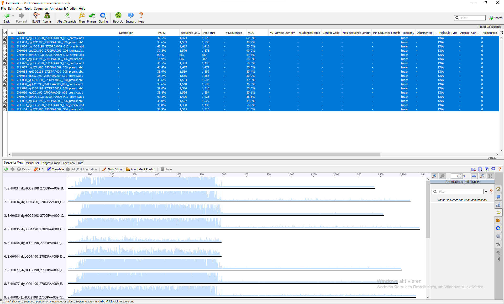

Opening individual files will show their chromatograms:

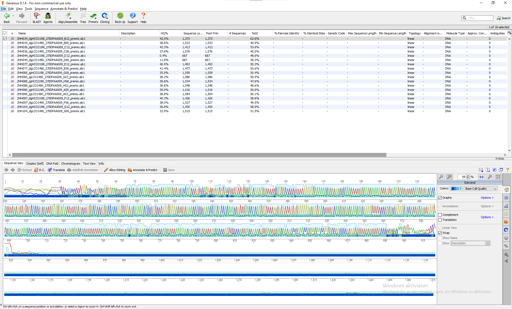

Assuming the files are named in a certain format, for example, mine is "\<sample\_name\>\_\<primer\>\_\<sequencing_run_info\>". A consistent and reasonable naming rule is important (throughout the entire life, actually). The benefit is that you can simply select all of them and click **De Novo Assemble**, and you can tell Geneious how to group your reads following your naming rules. 

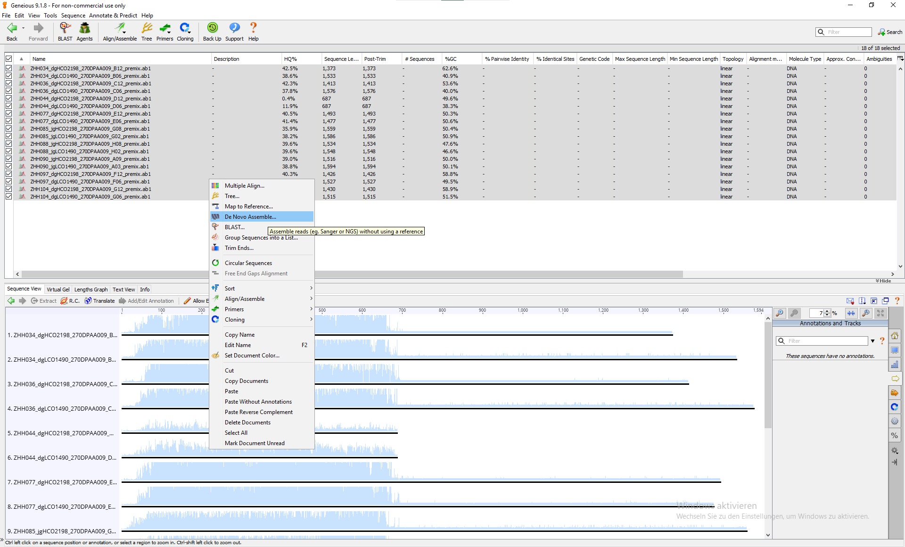

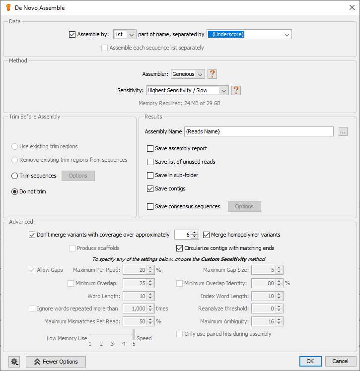{width="70%"}

We do not let the assembler trim the reads as we will do it manually later, and we want the assembly to be saved as contigs. The others can stay as the default. A report will be generated, and you might see that some sequences with low quality reads from both direction failed in generating contigs. 

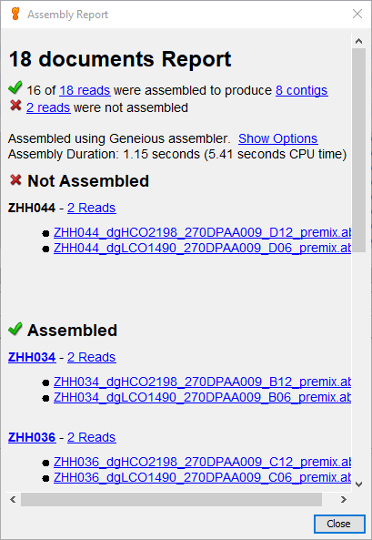{width="40%"}

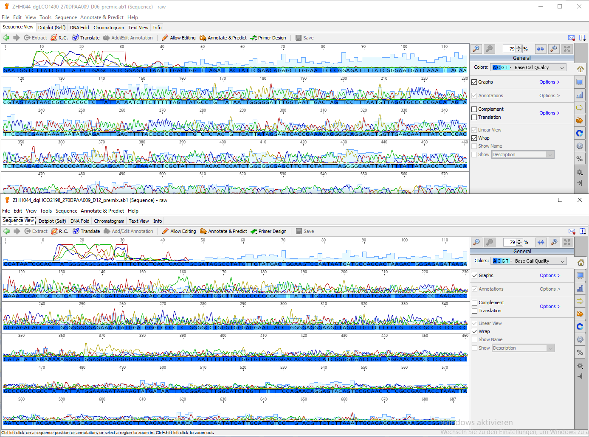

Opening one of the assembled contig, you see that the two reads are overlapping at the head region (5') of each read, meaning that they match with each other (since they were sequencing the same fragment). 

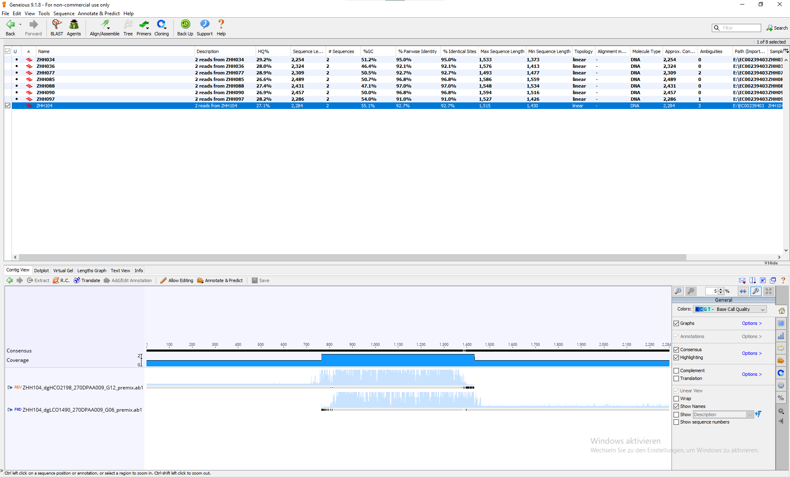

### Cleaning and editing

Enlarging the view shows us that both reads are still treated as traces, and this is a huge advantage because the confidence of the consensus shown on the top can be assessed by also accounting each base's sequencing quality. 

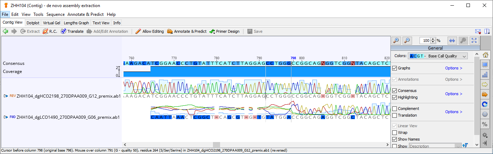

At this view, we will select the reagion where a good consensus can be calculated because at least one of the both reads has good quality. Make sure to select both sequences, and we would extract selected regions into a new file. 

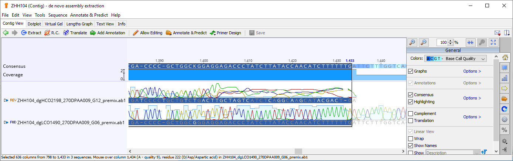

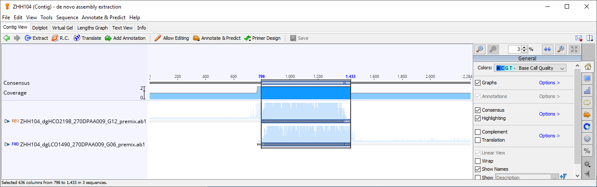

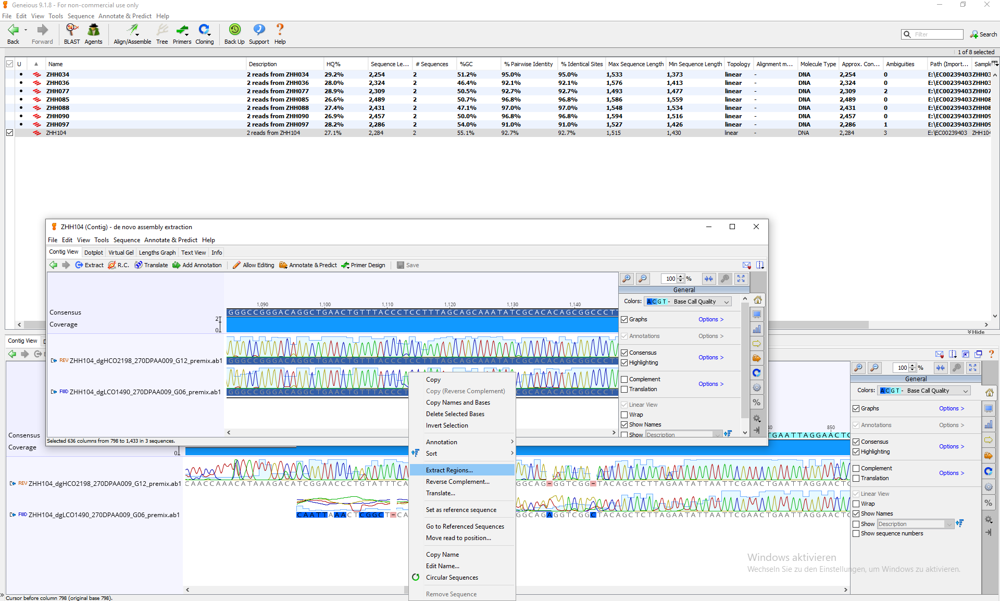 

This step is essentially trimming the sequence, but doing it after the _de novo_ assembly gives us advantages over trimming it before the assembly. Sometimes the reads are not as good as the ones we've seen here, most of their reads might just get discarded by the trimming algorithm, but if we assemble them anyway, we can still get a pretty good (at least useful) result by cross-checking the ambiguities with the reads from the other direction:

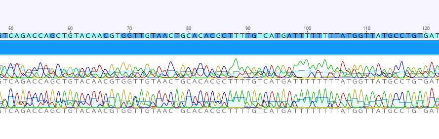

After extracting the contigs, we go into details to do some manual clean-up. Since we didn't trim the reads before assembly, it also comes with trade-offs. The first few bases of Sanger sequencing are always shitty, the reason is the dye blobs. And these reads confuse the assembler, so there are gaps `-` inserted into the consensus (also into the complement read). They are purely artificial, we have to remove them. It can be easily done by selecting the consensus (not the individual sequence) and deleting it. You will probably get a warning window telling you how to edit the sequence, so from now on you have to pay attention to the keyboard: do not type unconsciously. 

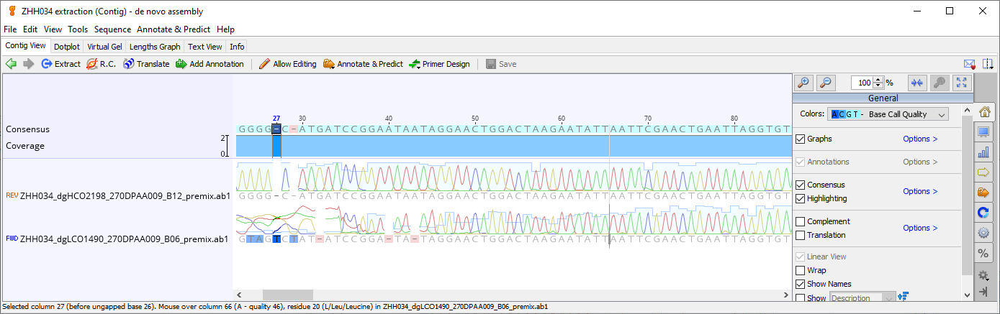

We remove all the gaps in the consensus at the beginning, and also at the end of the contig. You will see a red mark indicating deletion.

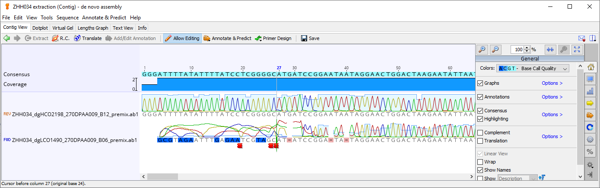

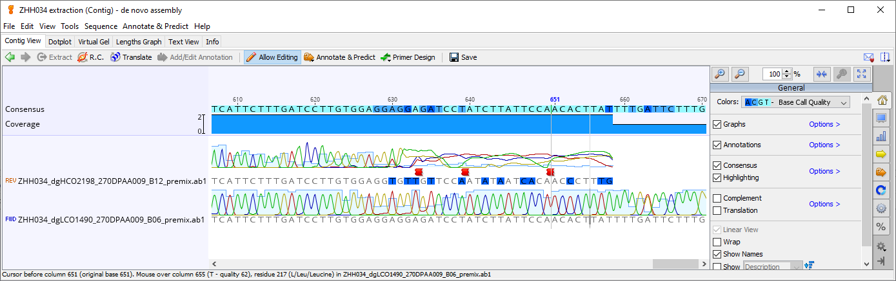

Sometimes the gap is indicated as ambiguity `N` when the wrong reads somehow produced a good quality and convinced the algorithm that there might be something. But we know from the context and chromatogram that it's the same as `-` gap, so we delete them too. 

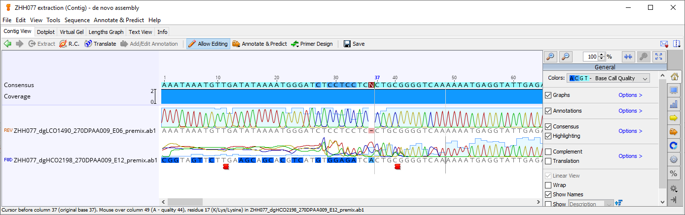

In a cleaned contig, ambiguities are allowed, but there should not be any `-` gaps in its consensus. After cleaning the gaps, there's one last thing to pay attention to. Any idea what's wrong with this contig?

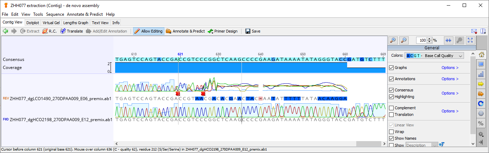

Left to the read file name, we see two marks: `FWD` and `REV`, stands for "forward" and "reverse". We know that LCO1490 is the forward primer, and HCO2198 is the reverse primer. Exactly, the direction marks are reversed in this contig, so we have to reverse-complement the entire contig to put it in the right direction. 

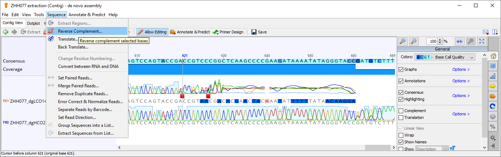

Some people do not do this step because many algorithms for multiple sequence alignment (MSA) nowadays can resolve the direction automatically. But skipping this step can become a time bomb if your analysis does not input the alignments you produce later. And it would be a lot of pain if you want to check anything in detail later. So be kind to yourself, spend a few seconds to check it. I couldn't find any settings in Geneious where I might be able to specify the forward / reverse primer when performing the *de novo* assembly. If anyone knows, please do let me know, because it seems quite unreal that software like Geneious doesn't have that feature. 

Once we have the direction solved, we are ready. You might also find some [ambiguities](https://www.bioinformatics.org/sms/iupac.html) in your contigs. They are fine for now and we will deal with them later, because we don't have enough information to resolve them at this point. 

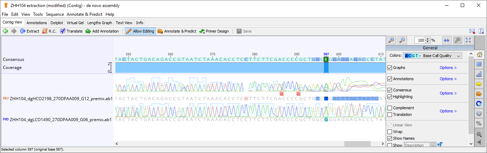

### Building consensus, checking for indels and reading frames

Since we have assembled the contig, we will make consensus sequences from the contigs and stop dealing with traces. Right-click the checked contigs and run "Generate Consensus Sequence". 

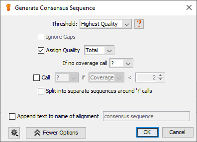{width="40%"}

With the built consensus, we can then run a multiple sequence alignment (MSA) and compare the sequences with each other. An important note here is that we run MSA here for quality check and exploratory purposes, not to build the final working alignment for analysis (we will do that later).

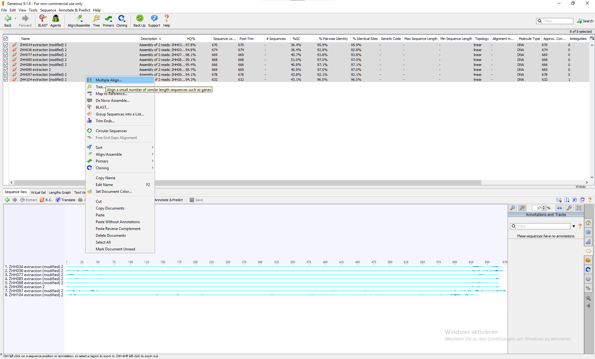

There are several MSA algorithms to choose from. You may call me cult but I simply recommend MAFFT, also for later, as long as your dataset is not extreme (large number of sequences or loci, wide range of taxa so that sequence evolution plays a significant role, etc.). Before the first use, you need to download the MAFFT plugin from Geneious to see the option. For our purpose now, we can leave all the parameters at the default. You can notice the difference in the placement of the sequences in the alignment view compared to just selecting all consensus sequences. 

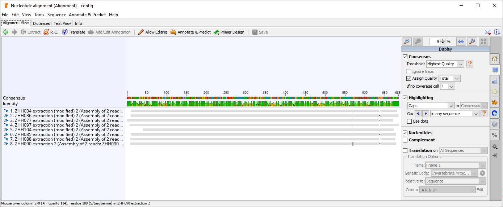

Enlarging the alignment and chaging the display setting also let you see in details.

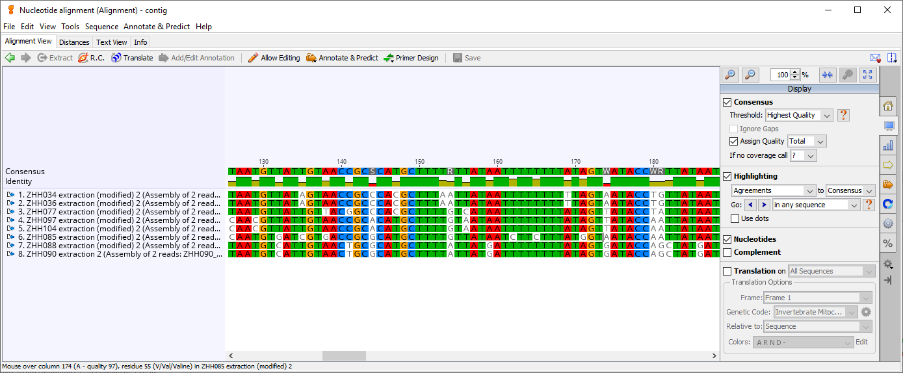

From this point, you need to have a basic understanding of the [Central Dogma of Molecular Biology](https://en.wikipedia.org/wiki/Central_dogma_of_molecular_biology). 

But what we are interested in is the one inserted `K`, also visible in the shrunken view. We see that the `K` only appears in one sequence and the positions in the rest are marked as gap `-`, and this is a classical _insertion_. Insertions and deletions are called together as _indel_. Indel naturally happens in sequence evolution, but not in this fashion. COI (cytochrome oxidase subunit I) gene is, as the name already says, a protein-coding gene, which means the nucleotide sequence has reading frames. And the reading frames of the eukaryotic lifeforms on this planet (most, if there are exceptions that I don't know of) are all triplets, i.e., every three bases are translated into an amino acid. That means a 1 bp insertion will mess up all the downstream translation and probably change most of the downstream amino acid sequence, and we call such an insertion a ["frameshift" mutation](https://en.wikipedia.org/wiki/Frameshift_mutation) (indels that are not a multiple of three). This will result in a huge change in protein functionality that most certainly comes with enormous selection forces. Simply put, this does not happen easily, and even if it happens, it is very hard for it to survive. To prove such an insertion is real, multiple lines of evidence are required to explain and support it. 

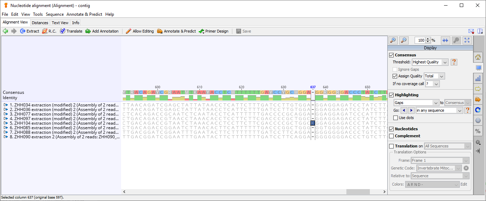

Given that our insertion is ambiguous, we can be very certain that it is purely artificial. By selecting the base, the information shown in the bottom left corner tells you where to find the base. We go back to the original sequence and find base 597, and it is exactly the `K` that we mentioned before. 

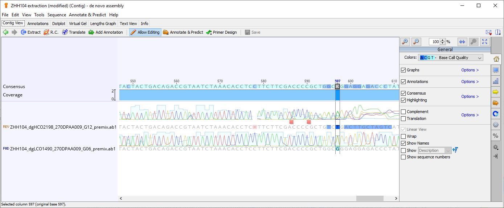

Now we can delete that artificial insertion with most confidence. Then we will repeat the process of generating consensus and run the MSA again, to confirm that the insertion is gone. 

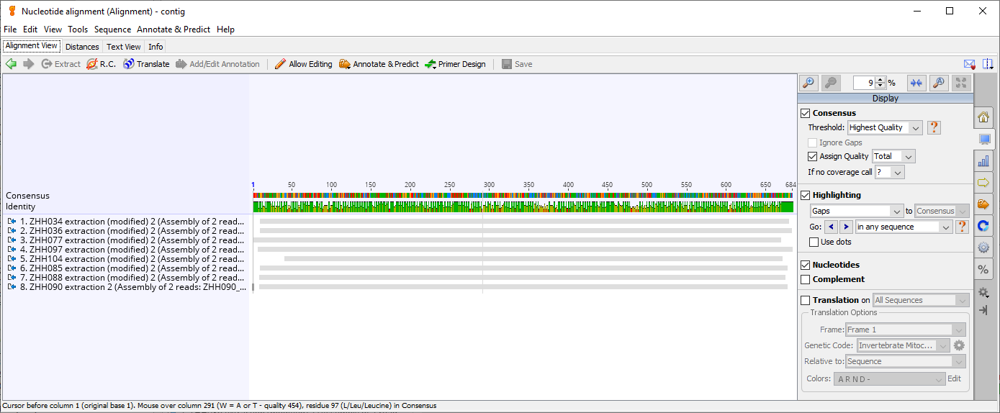

When you happen to encounter artificial deletions, then you will be dealing with gaps not in multiples of three, only existing in one (or a few) sequence. You can check the source traces to see if two or more peak signals were merged into fewer bases, then you can add the merged bases back manually. If not, it could be a noteworthy case (the sequence might not be the actual gene), and the safest way is to change the gap `-` to ambiguity `N`, which stands for anything. By doing that, we tell everyone reading the sequence that we think there is something at the site, but we don't know exactly what. If the other sequences all have the same base at the site, some people might also change the deletion to the consensus instead of `N`. But doing so would bring nothing, given that the existence of a 100% consensus means the site becomes completely [uninformative](https://en.wikipedia.org/wiki/Informative_site). So I recommend leaving them as `N`, it's the safest and most responsible way to deal with it. For most of the time, you do not have any actual support for filling a gap using consensus from other sequences. 

After checking the indels, we also have to check the reading frames. Changing the display option allows you to have a nicer view of the amino acid translations of our sequences. Note that you need to select the [correct genetic code](https://www.ncbi.nlm.nih.gov/Taxonomy/Utils/wprintgc.cgi), which is the table 5 for my lovely isopods.

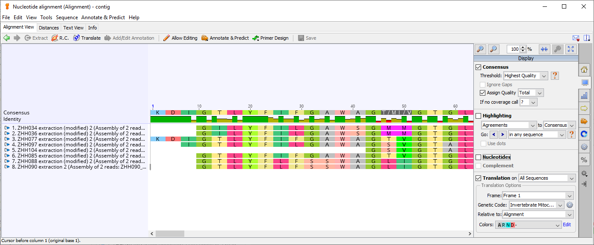

The detailed sequences are not particularly interesting to us at this point. But one thing is: [cytochrome oxidase](https://en.wikipedia.org/wiki/Cytochrome_c_oxidase) is a key point in the respiration process, and if a cell can't do that, it dies. So the COI must work, from gene to protein. What we check here is the stop codon, which terminates the translation process. A functional COI gene will not have any stop codons, at least within the region we sequenced. So if a sequence has one, it's definitely something else, very likely a [pseudogene](https://en.wikipedia.org/wiki/Pseudogene). In that case, you have to remove it (the entire sequence). I noticed that it is also important to check this on GenBank sequences that you intend to include in your analysis, because I have found multiple of them actually having stop codons despite being registered as COI genes (maybe noted as unverified, though). 

Of course, if you think one step further, you will realize that excluding stop codons does not fully exclude pseudogenes, because recently formed pseudogenes might not yet have introduced stop codons into themselves. It is a recognized problem in DNA barcoding, and it's not very easy to identify those pseudogenes if they haven't accumulated stop codons. Thic could be something you'd like to keep in mind in the later analysis, when something really odd comes up. More to read: 

- [Many species in one: DNA barcoding overestimates the number of species when nuclear mitochondrial pseudogenes are coamplified](https://www.pnas.org/doi/full/10.1073/pnas.0803076105)
- [Do pseudogenes pose a problem for metabarcoding marine animal communities?](https://www.authorea.com/doi/full/10.22541/au.163277441.14875855/v1)
- [“COI-like” Sequences Are Becoming Problematic in Molecular Systematic and DNA Barcoding Studies](https://academic.oup.com/jcb/article/29/1/96/2548098) 

If your alignment has stop codons everywhere, don't panic. It's probably just translated in the wrong frame. A sequence has six frames, as the tRNAs recognize triplets and we have two strands. But since we have ensured that our sequences are in the right direction during earlier steps, you must find a frame without any stop codon in the first three (non-reverse) frames. Or it might indicate that the naming of your trace files is reversed or there are other serious problems (which I haven't yet encountered). 

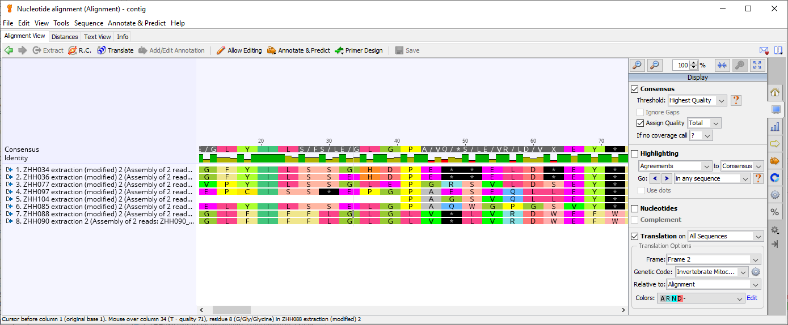

### Export

Once we have checked that the sequence is clean and has no frame-shifting indels or stop codons, we are ready to do analysis. I prefer to export the sequence here, not the alignment. But you can do it too if it fits your workflow better. I always export them in `fasta` format, as it's widely accepted and it's simple. Just pay attention to export options. Wrapping sequence lines (interleaved) is often a bad idea. Replacing spaces with underscores is a safe way to name the sequence, but I suggest adding a name-cleaning step in the workflow anyway. Sequence descriptions usually have too many wild characters, and it's really not the `fasta` file's job to store that information. 

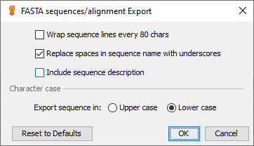{width="30%"}

## Assemble by reference

Sometimes, when the sequencing scheme is more complex and the target genes are variable, it can be tricky to assemble the contig only using the sequenced reads. For example, the whole 18S gene. We sequence it using 8 primers, but they are not one-to-one paired like 4 forward-reverse primer pairs. They are placed in offset so that the sequenced reads can cover the entire 18S gene region. Beside following the same steps I described in the previous section to perform simple _de novo_ assembly, one could also try to provide a guiding tree indicating the reads relationships and their overlapping scheme. But it is quite complex and does not produce much better result when there's a problem already choking simple _de novo_ assembly (I tried). 

Before we dive deep into detailed assembly, a little background on ribosomal gene and a note on the terminologies (although some journals don't pay attention to it anyway): [eukaryotic ribosome](https://en.wikipedia.org/wiki/Eukaryotic_ribosome) has two subunits, 40S and 60S. S is the Svedberg units indicating the sedimentation coefficients. It does not linearly correlate with the molecule's size, mass, or the unit itself. So 40S and 60S subunits together make an 80S eukaryotic ribosome, not 100S. 40S subunit contains an 18S RNA, and that's what we are referring to with "18S rRNA" (rRNA stands for ribosomal RNA). But the rRNA **is not** what we are sequencing. We sequence the **gene** of the 18S rRNA, meaning the DNA template (if you are already lost here, check the [Central Dogma](https://en.wikipedia.org/wiki/Central_dogma_of_molecular_biology) again). That means what we actually sequenced is the "18S rDNA", or "18S rRNA gene". This makes a difference because sequencing an 18S rRNA means we extracted the RNA, instead of the DNA, and our analyses are at the transcription level, not the genetic level. rRNA transcribed from DNA undergoes modification before they form a functional ribosome, so the interpretation of the result could be completely different between 18S rDNA and 18S rRNA. So use the terms carefully and accordingly, especially in your final work. That's also why we will not be dealing with any uracil (U) in the sequences, because they are DNA (yet). 

The whole 18S gene can be divided into several regions, some of them are conserved, some are variable. Since it is not a protein-coding gene, there's no reading frame nor evolutionary stress following the codon scheme. Instead, they are affected by the RNA's secondary structures, and some motifs are so wild that they can easily nuke the _de novo_ assembly. 

So what we do is like the example here: we take a known sequence of the target gene as a reference (blueprint), preferably from closely related taxa, and map our reads against it. The conserved regions will hopefully match the reference and guide the variable regions. One way to do that is in Geneious, in the menu after right-clicking the trace files (tutorials will come). But I have developed a workflow for this in R with the `sangeranalyseR` package. 

### 

## Resources

- [BOLD v4 Handbook Chapter 7: Barcode Data Validation](https://v4.boldsystems.org/index.php/resources/handbook?chapter=7_validation.html) 